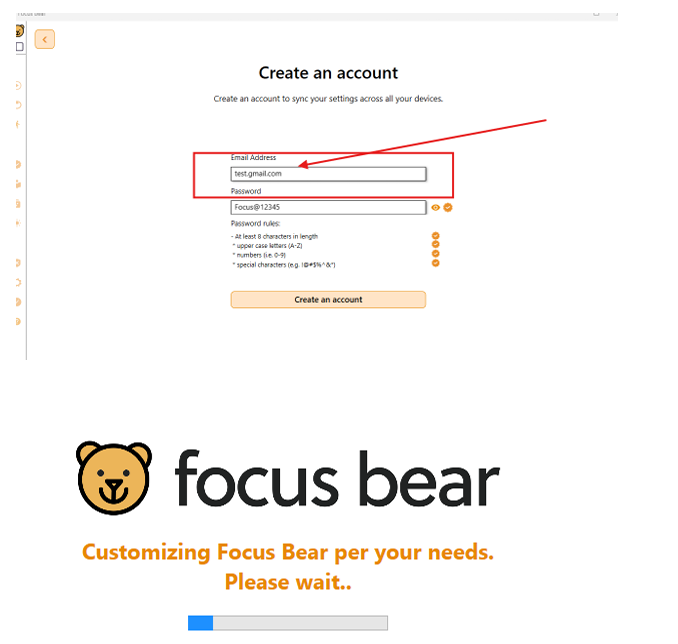
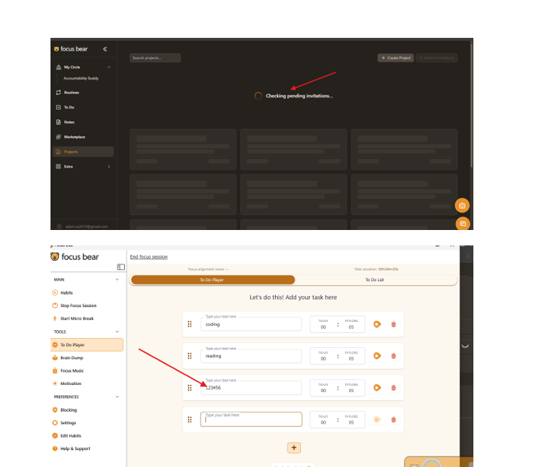
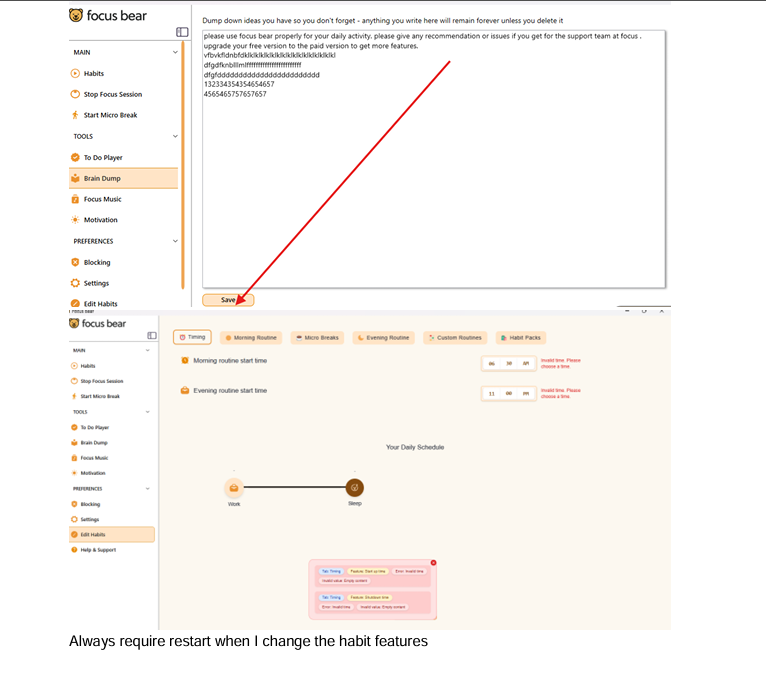

# Focus Bear App: First-Time User Experience Report

## 1. Bug: Onboarding Email Validation
* **Observation:** The account creation screen accepts invalid email formats (e.g., `test.gmail.com` without an "@" symbol).
* **Suggested Improvement:** Implement regex validation to ensure users enter a valid email address before they can proceed.

## 2. Bug: Manual Session Chronology Error
* **Observation:** If the "Finish Time" is set before the "Start Time," the error message says "Start time cannot be in the future," which is confusing and incorrect.
* **Suggested Improvement:** Change the error message to "Finish time must be after start time."

## 3. Bug: Habit Timing Validation
* **Observation:** Entering valid times like 06:30 AM or 11:00 PM still triggers an "Invalid time" error alert.
* **Suggested Improvement:** Fix the time-parsing logic to correctly recognize standard AM/PM formats.

## 4. Bug: Media Asset Loading Failure
* **Observation:** Custom habit instruction image URLs consistently fail to render, showing a "Failed to load" error.
* **Suggested Improvement:** Investigate the image proxy or URL handling to ensure images display correctly for users.

## 5. Bug: Billing Integration Loop
* **Observation:** The Team Subscription checkout page enters an infinite loading loop, preventing users from purchasing.
* **Suggested Improvement:** Resolve the network/server-side issue causing the hang on the checkout page.

## UX Improvement Idea
The app requires a manual restart whenever a habit feature is changed. This breaks the user's "flow." I suggest making the app auto-refresh or apply settings dynamically without a full restart.

